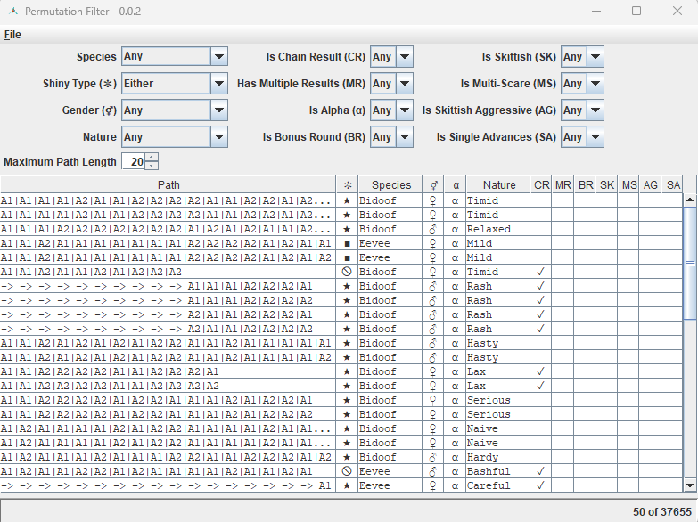
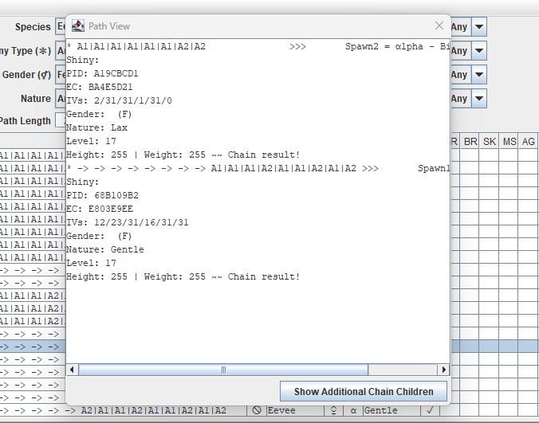
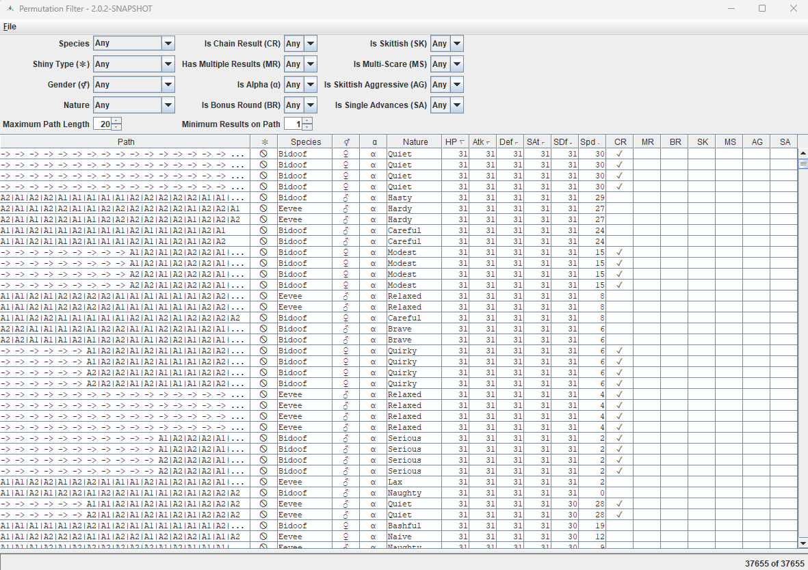

# PermuteMMOFilter
[](https://github.com/darkenzee/PermuteMMOFilter/actions/workflows/maven-build.yml) [](https://github.com/darkenzee/PermuteMMOFilter/actions/workflows/maven-build.yml) [](https://github.com/darkenzee/PermuteMMOFilter/actions/workflows/maven-release.yml) [](https://github.com/darkenzee/PermuteMMOFilter/actions/workflows/github-release.yml)


Tiny GUI program for filtering path results from PermuteMMO.

Requires [Java 8](https://github.com/corretto/corretto-8/releases) or higher to run.

Load text file from PermuteMMO discord bot or paste short-form text into input from your own PermuteMMO output.

## Discord Bot Format
```
* A1|A3|G1|G1|CR|A2                     >>> Bonus Spawn2 = NOT αlpha - Bronzong
Shiny: ★ - Shiny Rolls:   3
PID: FF6F97F5
EC: 64BB35F8
IVs: 2/31/31/31/31/29
Gender: 
Nature: Impish
Level: 63
Height: 74 | Weight: 106
* A1|A3|G1|G1|CR|A3                     >>> Bonus Spawn2 = NOT αlpha - Bronzong
Shiny: ★ - Shiny Rolls:   3
PID: FF6F97F5
EC: 64BB35F8
IVs: 2/31/31/31/31/29
Gender: 
Nature: Impish
Level: 63
Height: 74 | Weight: 106
```

## Short Format
```
* A1|A1|A1|A1|A1|G1|G2|CR|A1|A1         >>> Bonus Spawn1 = α-Rotom: 19 * 31/12/31/28/31/31 Hardy   -- Single advances!
* A1|A1|A1|A1|A1|G1|G2|CR|A1|A2         >>> Bonus Spawn1 = α-Rotom: 19 * 31/12/31/28/31/31 Hardy
* A1|A1|A1|A1|A2|G1|CR|A1|A1|A3         >>> Bonus Spawn3 = α-Rotom: 12 * 31/31/31/28/30/31 Brave
* A1|A1|A1|A2|G3|CR|A4                  >>> Bonus Spawn4 = α-Rotom: 18 * 31/07/31/31/31/02 Relaxed
```


## Screenshots



Double click on a row to show original text with chain parents (plus optionally show additional chain children).



## Table sorting
The table can be sorted on a particular column by clicking on the headers as follows.

 * Mouse-click: Clears the sorting status of all other columns and advances the sorting status of that column through three values: {NOT_SORTED, ASCENDING, DESCENDING} (then back to NOT_SORTED again).

 
 * SHIFT-mouse-click: Clears the sorting status of all other columns and cycles the sorting status of the column through the same three values, in the opposite order: {NOT_SORTED, DESCENDING, ASCENDING}.


 * CONTROL-mouse-click and CONTROL-SHIFT-mouse-click: as above except that the changes to the column do not cancel the statuses of columns that are already sorting - giving a way to initiate a compound sort.

 

